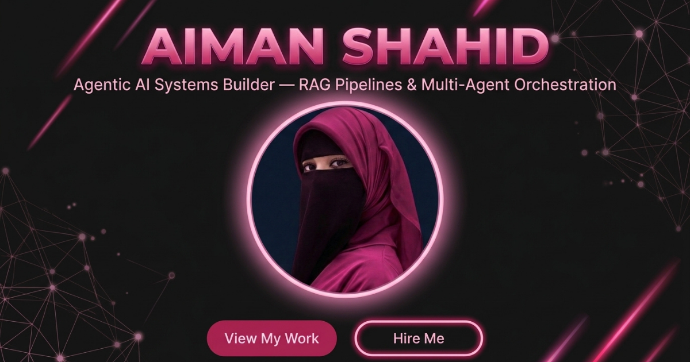

# Aiman Shahid | Personal Portfolio 🚀

A modern, highly interactive, futuristic personal portfolio built with **Next.js 15**, **React 19**, **Tailwind CSS v4**, **GSAP**, and **Framer Motion**. Designed for smooth user experience, glassmorphic UI, dynamic WebGL shader background (Soft Aurora), and interactive UI animations.

 *(Optional preview placeholder)*

---

## ✨ Features & Highlights

- 🌌 **Interactive WebGL Background (`SoftAurora`)**: Custom Canvas WebGL shader background with mouse interaction support.
- 🎨 **Futuristic Design System**: Glassmorphism, neon gradient accents (`#FF6B9D`, `#FF2D78`), clean typography, and sleek dark mode.
- ⚡ **Interactive Components**:
  - **Dynamic Blur & Typing Text**: Powered by custom animated text components.
  - **Magnetic Elements**: Smooth cursor attraction effects on profile image and interactive elements.
  - **Interactive Projects Carousel**: Showcase of AI agents and web apps with custom controls.
  - **Scroll Timeline**: Animated journey tracking Computer Science and Agentic AI milestones.
- 📱 **Fully Responsive Layout**: Built mobile-first with desktop sidebar navigation and an interactive mobile drawer menu.
- 📧 **Interactive Contact Form**: Integrated with custom toast notifications (`Sonner`) and form validation (`Zod` + `React Hook Form`).

---

## 💻 Featured Projects

1. 🤖 **AI Task Teller**: Intelligent task automation agent leveraging OpenAI SDK and agentic workflows.
2. 🎓 **Nyra Chatbot**: Personalized AI assistant designed for study management, learning assistance, and interactive Q&A.

---

## 🛠️ Tech Stack & Dependencies

### **Core Frameworks & Tools**
- **Framework**: [Next.js 15 (App Router)](https://nextjs.org/)
- **UI Library**: [React 19](https://react.dev/)
- **Styling**: [Tailwind CSS v4](https://tailwindcss.com/), [PostCSS](https://postcss.org/)
- **Language**: [TypeScript](https://www.typescriptlang.org/)

### **Animations & Graphics**
- **Framer Motion (`motion`)** & **GSAP**: High-performance UI micro-animations and scroll progress tracking.
- **OGL**: Light-weight WebGL library for shader effects (`SoftAurora`).
- **Lenis**: Smooth scrolling engine.

### **UI Components & Icons**
- **Radix UI Primitives**: Accessible UI components (`@radix-ui/*`).
- **Lucide React**: Modern icon set.
- **Sonner**: Toast notification library.

---

## 🎓 Education & Background

- 🎓 **BS Computer Science (2023 – 2027)** – Lahore College for Women University (LCWU)
- 🤖 **Agentic & Robotic AI Engineering (2024 – Present)** – PIAIC (Batch 57)
- 📜 **Fundamentals of Agentic AI Level 1 & Level 2 Certifications**

---

## 🚀 Getting Started

Follow these steps to run the portfolio locally on your machine.

### Prerequisites

Ensure you have **Node.js 18+** and a package manager (`npm`, `pnpm`, or `yarn`) installed.

### Installation

1. **Clone the repository**:
   ```bash
   git clone https://github.com/aimanshahid800/My-Portfolio.git
   cd My-Portfolio
   ```

2. **Install dependencies**:
   ```bash
   npm install
   # or
   pnpm install
   ```

3. **Run the development server**:
   ```bash
   npm run dev
   ```

4. Open [http://localhost:3000](http://localhost:3000) in your browser to view the portfolio.

---

## 📜 Available Scripts

- `npm run dev`: Runs the app in development mode with hot reloading.
- `npm run build`: Builds the production-ready bundle.
- `npm run start`: Starts the production server.
- `npm run lint`: Runs ESLint to check for code formatting and syntax errors.

---

## 📫 Contact & Links

- **Portfolio Live Demo**: [v0-portfolio-style-inspiration.vercel.app](https://v0-portfolio-style-inspiration.vercel.app/)
- **GitHub**: [@aimanshahid800](https://github.com/aimanshahid800)
- **LinkedIn**: [Aiman Shahid](https://linkedin.com) *(Update with your LinkedIn link)*

---

*Designed & Developed with ❤️ by Aiman Shahid.*
